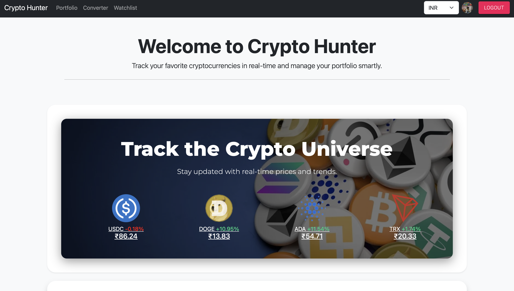
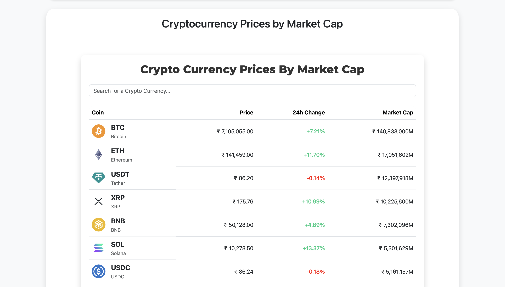
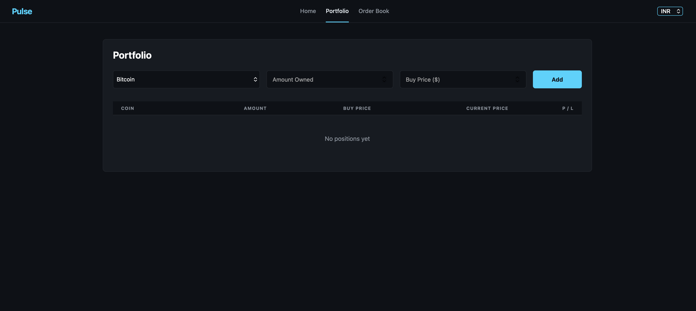
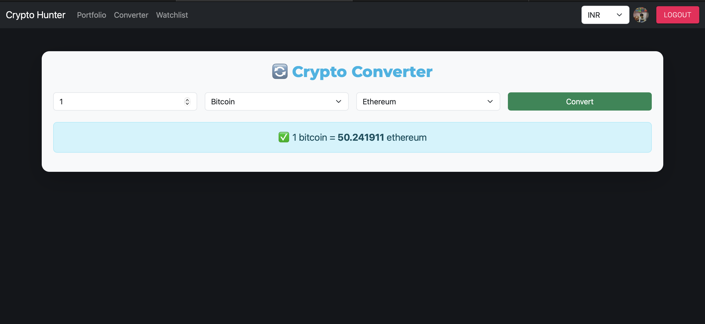
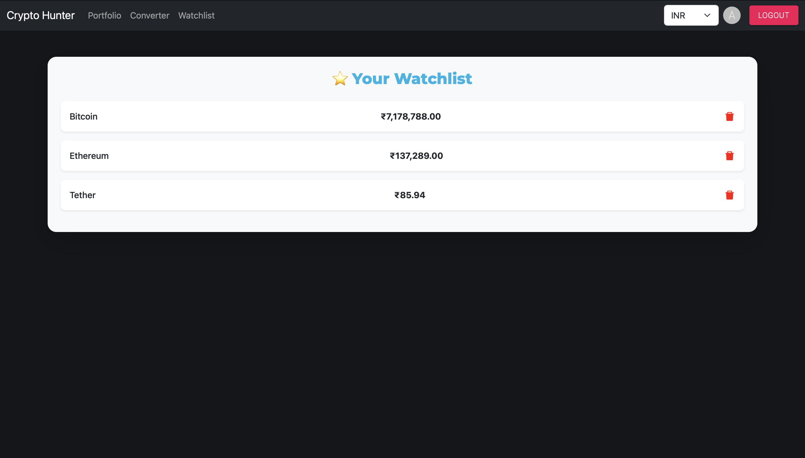

# 💹 Crypto Tracker

A sleek and powerful React-based cryptocurrency tracking web app where you can monitor live crypto prices, manage your portfolio, track your watchlist, and convert currencies with ease.

---

## 🚀 Features

- 🌐 Real-time prices of 100+ cryptocurrencies (powered by CoinMarketCap API)
- 🔍 Search and sort cryptocurrencies by name or symbol
- 📊 Detailed coin view with charts and statistics
- ⭐ Add and manage your **Watchlist**
- 📈 **Portfolio Manager**: Track your holdings and calculate net worth
- 🔁 **Crypto Converter**: Convert between different coins and currencies
- 🔐 Firebase Authentication with Google login
- 🌙 Clean and responsive UI with dark mode-inspired styling

---

## 🖼️ Screenshots

> **Note:** Screenshots are located in the `/assets/screenshots/` folder (you can change the path based on where you upload).

### 🔸 Home Page

  


### 🔸 Portfolio Page



### 🔸 Converter Page



### 🔸 Watchlist Page



---

## ⚙️ Tech Stack

- **Frontend**: React.js, TailwindCSS, Bootstrap, Material-UI  
- **Authentication**: Firebase  
- **Crypto API**: CoinGecko
- **State Management**: React Context API  

---

## 🧠 How to Run Locally

### 🪟 Windows & 🍎 macOS

> Make sure you have **Node.js** and **npm** installed.

1. **Clone the Repository**
   ```bash
   git clone https://github.com/aryxnn/crypto-tracker.git
   cd crypto-tracker
2. **Install Dependencies**
   npm install
3. **Add Firebase Configuration**
   pre> ``` REACT_APP_FIREBASE_API_KEY=your_api_key REACT_APP_FIREBASE_AUTH_DOMAIN=your_auth_domain REACT_APP_FIREBASE_PROJECT_ID=your_project_id REACT_APP_FIREBASE_STORAGE_BUCKET=your_storage_bucket REACT_APP_FIREBASE_MESSAGING_SENDER_ID=your_messaging_sender_id REACT_APP_FIREBASE_APP_ID=your_app_id ``` </pre>
4. **Start the App**
   npm start

**The app should now be running at:**
👉 http://localhost:3000
