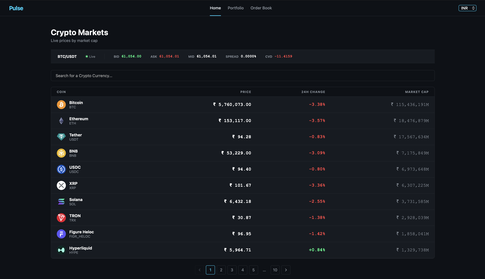
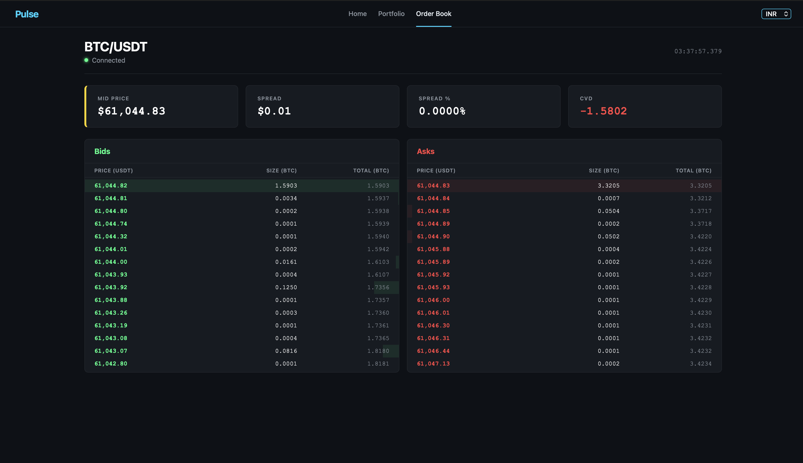

# Pulse Terminal

Pulse Terminal is a full-stack, containerized real-time cryptocurrency trading interface and market data platform. The system streams order book data from Binance WebSockets, processes and aggregates order book parameters, synchronizes state via Redis, and renders a high-performance terminal UI.

## Architecture

```
                       +-------------------+
                       | Binance WebSocket |
                       +---------+---------+
                                 | (wss://stream.binance.com)
                                 v
                       +---------+---------+
                       |  binance_ws.py    |
                       +----+---------+----+
                            |         | (Every 60s)
               (Redis Pub)  |         v
                            |  +------+------+
                            |  | PostgreSQL  |
                            v  +------+------+
                       +----+----+    |
                       |  Redis  |    | (GET /api/ohlcv)
                       | Pub/Sub |    |
                       +----+----+    |
                            |         |
               (Redis Sub)  |         |
                            v         v
                       +----+---------+----+
                       |    FastAPI WS     | (main.py)
                       +---------+---------+
                                 | (WebSocket)
                                 v
                       +---------+---------+
                       |   React Client    | (Pulse UI)
                       +-------------------+
```

---

## Features

* **Real-Time Order Book Engine**: Connects to the Binance L2 depth stream and pushes real-time bid and ask arrays to the client with sub-100ms latency.
* **Microstructure Metrics**: Computes key market-microstructure metrics on every packet:
  * **Mid Price**: Average of best bid and best ask.
  * **Spread**: Difference between best ask and best bid.
  * **CVD (Cumulative Volume Delta)**: Volume differences (bid volume minus ask volume) across the top 20 price levels to track net buying and selling pressure.
* **Upstash Redis Integration**: Uses TLS-secured Redis pub/sub broker to fan out updates to multiple clients.
* **Memory Optimization**: Employs capped local order book state tracking, pruning zero-quantity levels and restricting stored records to the top 20 entries.
* **Vega Engine UI**: A dark-themed trading desk dashboard with proportional depth bars and instant visual updates.

---

## Screenshots

### Home Page


### Order Book


---

## Tech Stack

| Component | Technology |
| :--- | :--- |
| **Backend** | Python 3.11, FastAPI, Uvicorn |
| **Streaming** | Binance WebSocket, websockets library |
| **Pub/Sub Broker** | Redis 7 (Alpine) |
| **Database** | PostgreSQL 15 (Alpine), asyncpg |
| **Frontend** | React, Bootstrap |
| **Infrastructure** | Docker, Docker Compose |

---

## Getting Started

To spin up the local development environment containing the FastAPI backend, Redis, and PostgreSQL, run:

```bash
docker compose up --build
```

Start the React client separately from the project root:

```bash
npm install
npm start
```
